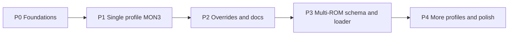

# Plan: Platform ROM bundles, materialization, and overrides

This document captures the agreed product direction (extension as default vendor of ROM + listing + source; workspace as overridable runtime; multi-ROM readiness; manual projects without wizard) and breaks work into **sequenced tickets**.

## Goals

1. **Bundled defaults**: Ship canonical ROM artifacts (bin/hex), listings, and optional source snapshots inside the Debug80 VSIX for supported platform profiles (starting with TEC-1G + MON3).
2. **Materialize on scaffold**: When creating a project (or explicit “install bundled assets”), copy defaults into **stable workspace paths** so `debug80.json` uses normal project-relative paths and the debugger maps sources like any other project.
3. **Always overridable**: Users may replace files or change paths in `debug80.json`; no hidden dependency on extension paths for day-to-day debugging.
4. **Manual projects**: A repo created without the wizard must work if `debug80.json` + files on disk are valid.
5. **Multi-ROM / future platforms**: Design config and loaders so **multiple ROM regions** (e.g. TEC-1G low + high ROM) are first-class, not ad hoc single `romHex` special cases.
6. **Lazy load**: Do not load large bundles at activation; load when a profile needs them.

## Design principles

| Principle | Implication |
|-----------|-------------|
| **Extension = distribution** | Versioned payloads + manifest (checksums, profile id, compatible Debug80 version range). |
| **Workspace = execution** | `debug80.json` points at workspace files; adapter reads those paths. |
| **Config is the contract** | Override = edit JSON and/or replace files under those paths. |
| **No mandatory wizard** | Wizard only accelerates layout; same behavior if user hand-authors config. |

## Suggested on-disk layout (workspace)

Convention only; final names should be validated in **TICKET-02**.

```
<project>/
  .vscode/debug80.json
  roms/
    tec1g/
      mon3/                    # one “bundle id” folder
        mon3.bin               # or .hex — whatever program-loader already accepts
        mon3.lst               # for extraListings / D8
        src/                   # optional; for editor + mapping
          ...
  .debug80/                    # optional cache (already exists); not source of truth
    cache/
```

Alternative: `.debug80/vendor/mon3/…` for “generated from extension” vs `roms/` for user-owned — decide in TICKET-02 to avoid two competing trees.

## Phases (high level)



- **P0**: Manifest format, extension resource layout, read-only access from extension code.
- **P1**: Materialize MON3 default into scaffold; wire `tec1g.romHex` + `extraListings` + `sourceRoots` to copied paths.
- **P2**: Override UX, upgrade/repair command, documentation for manual projects.
- **P3**: Generalize program loader + `debug80.json` schema for **N** ROM regions on TEC-1G (backward compatible).
- **P4**: Additional bundled profiles, CI for bundle checksums, size budgets.

---

## Ticket backlog (sequenced)

Tickets are ordered by **recommended implementation sequence**. Dependencies are listed; parallel work is noted where safe.

---

### P0 — Foundations

#### TICKET-01 — Define bundle manifest schema (RFC + ADR)

**Summary**: Specify JSON (or TS type) for a **platform ROM bundle**: `id`, `version`, `platform` (`tec1g`), `files[]` (role: `rom` | `listing` | `source_tree`, path inside bundle, optional sha256), `memory` hints if needed for validation.

**Acceptance criteria**

- [ ] Document in `docs/plans/` or `docs/` with example for MON3.
- [ ] Schema version field for future migrations.
- [ ] Review against existing `tec1g` config in `src/debug/types.ts` / program-loader.

**Dependencies**: None.  
**Estimate**: S.

---

#### TICKET-02 — Reserve extension directory layout for bundled payloads

**Summary**: Under `extension/` resources (e.g. `bundles/tec1g/mon3/v1/` or `resources/bundles/...`), define where VSIX-packaged files live; ensure `package.json` `files` / VSCE packaging includes them without bloating unrelated installs (optional: separate optional pack later).

**Acceptance criteria**

- [ ] Path convention documented; matches manifest in TICKET-01.
- [ ] Build still passes; VSIX size impact noted in ticket / README.

**Dependencies**: TICKET-01.  
**Estimate**: S.

---

#### TICKET-03 — Runtime API: list / read / verify bundle (extension host)

**Summary**: Small module (e.g. `src/extension/bundle-registry.ts`) that given `bundleId` returns `Uri` to files inside extension, verifies checksum optional, exposes “materialize to workspace folder” primitive (copy file/dir).

**Acceptance criteria**

- [ ] Unit tests with mock extension root.
- [ ] No file copy at activation; API is lazy.

**Dependencies**: TICKET-01, TICKET-02.  
**Estimate**: M.

---

### P1 — MON3 happy path

#### TICKET-04 — Materialize MON3 bundle into workspace (command + scaffold hook)

**Summary**: Implement `debug80.materializeBundledRom` or fold into existing **create project** / scaffold flow: copy bin/hex, lst, and optional `src/` from extension bundle to agreed workspace paths (TICKET-02 layout).

**Acceptance criteria**

- [ ] Idempotent or explicit overwrite policy (prompt or `--force` flag).
- [ ] Works when `debug80.json` already exists (merge vs skip documented).

**Dependencies**: TICKET-03.  
**Estimate**: M.

---

#### TICKET-05 — Wire default `debug80.json` for TEC-1G to materialized paths

**Summary**: Project scaffolding templates (`project-scaffolding.ts` / templates) should set `tec1g.romHex`, `tec1g.extraListings`, `tec1g.sourceRoots` (as needed) to **workspace-relative** paths after TICKET-04.

**Acceptance criteria**

- [ ] New project debugs MON3 with stop-on-entry showing mapped source (when listing present).
- [ ] Matches existing merge rules for shared root `tec1g` vs per-target overrides.

**Dependencies**: TICKET-04.  
**Estimate**: M.

---

#### TICKET-06 — CI / legal: LICENSE and third-party attribution for MON3 snapshot

**Summary**: Ensure bundled MON3 bits comply with upstream LICENSE; add `NOTICE` or `ThirdPartyNotices` in VSIX if required.

**Acceptance criteria**

- [ ] License file(s) in bundle or repo root reference.
- [ ] Release checklist updated.

**Dependencies**: TICKET-02 (once files present).  
**Estimate**: S–M (legal review may extend).

---

### P2 — Overrides, manual projects, UX

#### TICKET-07 — Document “manual project” and override paths

**Summary**: Extend `docs/platforms.md` (or platform README) with: no wizard required; required keys; how to point at custom MON3 build; how `extraListings` + `sourceRoots` interact.

**Acceptance criteria**

- [ ] Example `debug80.json` snippet for hand-crafted repo.
- [ ] Link from main README or Debug80 Home doc.

**Dependencies**: TICKET-05 (stable path convention).  
**Estimate**: S.

---

#### TICKET-08 — “Refresh bundled ROM assets” command (optional)

**Summary**: Command to re-copy extension bundle into workspace paths when extension updates (checksum mismatch); non-destructive default (backup or diff).

**Acceptance criteria**

- [ ] User confirmation if local files differ from bundled checksum.
- [ ] Logged to Output channel.

**Dependencies**: TICKET-04.  
**Estimate**: M.

---

#### TICKET-09 — Telemetry / logging (optional, privacy-safe)

**Summary**: When materialization runs, log success/failure (no PII); helps support.

**Acceptance criteria**

- [ ] Behind existing logger; no network unless already allowed.

**Dependencies**: TICKET-04.  
**Estimate**: S.

---

### P3 — Multi-ROM and loader generalization

#### TICKET-10 — RFC: multi-ROM memory model for TEC-1G

**Summary**: Design how `program-loader` / `tec1g` config represent **multiple** ROM images (addresses + file paths + optional listings per region). Backward compatible: single `romHex` maps to one region as today.

**Acceptance criteria**

- [ ] ADR with migration table from current `romHex`.
- [ ] Validation rules (non-overlap, coverage).

**Dependencies**: TICKET-01.  
**Estimate**: M–L.

---

#### TICKET-11 — Implement loader + config merge for multi-ROM (TEC-1G)

**Summary**: Implement TICKET-10 in code; tests in `tests/debug/program-loader.test.ts` / `tec1g-shadow` as appropriate.

**Acceptance criteria**

- [ ] Existing single-ROM configs unchanged in behavior.
- [ ] New multi-ROM config loads and debug session starts.

**Dependencies**: TICKET-10.  
**Estimate**: L.

---

#### TICKET-12 — Map multiple `extraListings` / per-ROM listing merge rules

**Summary**: Clarify how D8 merge order works when listings cover different regions (already partial in mapping-service); document and test.

**Acceptance criteria**

- [ ] Tests for two `.lst` files non-overlapping segments.
- [ ] Document conflicts / precedence.

**Dependencies**: TICKET-11.  
**Estimate**: M.

---

### P4 — Scale-out and hardening

#### TICKET-13 — Additional platform profiles (template)

**Summary**: Repeatable checklist to add a new bundled profile (e.g. TEC-1 MON-1B): manifest entry, bundle folder, scaffold snippet, tests.

**Acceptance criteria**

- [ ] `docs/platform-development-guide.md` updated with “bundled ROM profile” section.

**Dependencies**: TICKET-04–05 pattern stable.  
**Estimate**: M.

---

#### TICKET-14 — VSIX size and lazy packaging strategy

**Summary**: If bundle count grows, evaluate lazy download vs split extension pack; out of scope until size hurts.

**Acceptance criteria**

- [ ] Decision doc when total bundle size exceeds N MB.

**Dependencies**: Multiple bundles shipped.  
**Estimate**: S (spike).

---

## Recommended sequencing (milestones)

| Milestone | Tickets | Outcome |
|-----------|---------|---------|
| **M1** | 01–03 | Can ship bytes in VSIX and read them reliably. |
| **M2** | 04–06 | New TEC-1G project gets materialized MON3 + debuggable listing/source. |
| **M3** | 07–09 | Overrides and refresh story documented / optional. |
| **M4** | 10–12 | Multi-ROM TEC-1G config + tests. |
| **M5** | 13–14 | Repeatable process + size strategy. |

---

## Out of scope (for this plan)

- Changing MON3 upstream; we only **snapshot** a released build.
- Private git submodules for end users (optional workflow remains in user docs).
- Emulator accuracy changes unrelated to file layout.

---

## Tracking

Copy ticket IDs into your issue tracker (GitHub Issues, Jira, etc.) and link this document. Update **TICKET-02** paths and **TICKET-10** schema here when implementation choices are finalized.

### Implementation status (Debug80 repo)

| Milestone | Status | Notes |
|-----------|--------|--------|
| **M1** (TICKET-01–03) | **Done** | `src/extension/bundle-manifest.ts` (schema v1 + `isBundleManifestV1`), `resources/bundles/tec1g/mon3/v1/` layout, `src/extension/bundle-materialize.ts` (`materializeBundledRom`, lazy copy). Unit tests: `tests/extension/bundle-materialize.test.ts`. |
| **M2** (TICKET-04–06) | **Done** | Same as above, plus bundled **`mon3.lst`** (ASM80 listing from upstream BC25 source zip; see bundle `README.md`). TICKET-01 remains this plan + TS types; separate ADR not written. |
| **M3+** | Not started | Overrides docs, refresh command, multi-ROM (P3), etc. |

VSIX packaging: `.vscodeignore` excludes `src/**` and `test/**` but **not** `resources/`, so `resources/bundles/**` is included in the packaged extension.
