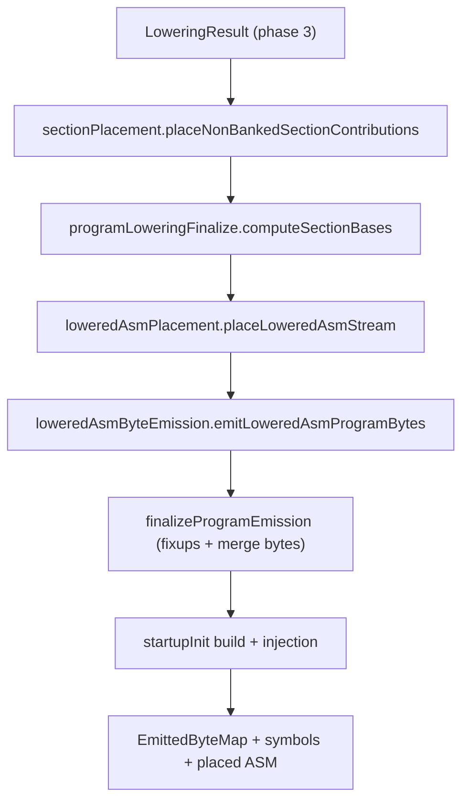

# Fixup Finalization and Legacy Section Flow

This document explains the current fixup/finalization flow and the inherited
ZAX named-section placement machinery that still sits inside it. The fixup and
output-map pieces are AZM infrastructure. ZAX named sections and startup init
hooks are retirement/quarantine behavior, not AZM-native language surface.

## What this flow owns

Finalization is responsible for:

- resolving fixups (ABS16 and REL8) and deferred externs
- placing inherited ZAX named-section contributions while that code remains
- merging code/data/hex bytes into the final `EmittedByteMap`
- placing lowered ASM blocks and emitting bytes
- injecting inherited ZAX startup init routines for named data sections

## Core flow

## Stage breakdown

### 1. Fixup emission (phase 3)

File: [`src/lowering/fixupEmission.ts`](../../src/lowering/fixupEmission.ts)

Responsibilities:

- Emit placeholder bytes for:
  - ABS16 (`emitAbs16Fixup*`)
  - REL8 (`emitRel8Fixup`)
- Enqueue fixup records with offsets and symbol targets.

These records are collected during lowering and resolved later in finalization.

### 2. Legacy named section contribution sinks

File: [`src/lowering/sectionContributions.ts`](../../src/lowering/sectionContributions.ts)

Responsibilities:

- Create `NamedSectionContributionSink` objects per named section contribution.
- Capture bytes, fixups, pending symbols, and startup-init actions as lowering emits
  into named sections.

This is inherited ZAX behavior. Native AZM should not add new dependencies on
this path.

### 3. Legacy placement of named sections

File: [`src/lowering/sectionPlacement.ts`](../../src/lowering/sectionPlacement.ts)

Responsibilities:

- Evaluate anchor bases and bounds for named sections.
- Place each contribution in order and compute absolute bases.
- Detect overlaps and out-of-range placements.
- Collect symbols from placed contributions.

This remains documented so deletion can be done deliberately. It should not be
treated as a design reference for new AZM features.

### 4. Base computation + fixup resolution

File: [`src/lowering/programLoweringFinalize.ts`](../../src/lowering/programLoweringFinalize.ts)

Responsibilities:

- Compute `codeBase`, `dataBase`, `varBase` (explicit or default).
- Resolve:
  - `fixups` (ABS16)
  - `rel8Fixups`
  - `deferredExterns`
- Merge section bytes into the final byte map (`writeSection`).

Diagnostics here include:

- unresolved symbols
- address out-of-range fixups
- rel8 displacement out of range
- hex byte overlaps/out-of-range

### 5. Lowered ASM placement and emission

Files:

- [`src/lowering/loweredAsmPlacement.ts`](../../src/lowering/loweredAsmPlacement.ts)
- [`src/lowering/loweredAsmByteEmission.ts`](../../src/lowering/loweredAsmByteEmission.ts)

Responsibilities:

- Place lowered ASM stream blocks using section bases and named-section origins.
- Emit placed blocks to:
  - `codeBytes`
  - `dataBytes`
  - `namedBytesByKey`
  - `blockSizesByKey`

### 6. Legacy startup init injection

File: [`src/lowering/startupInit.ts`](../../src/lowering/startupInit.ts)

Responsibilities:

- Build a startup init region from named data section actions (copy/zero).
- Emit a startup routine and data blob after the highest written address.
- Inject `__zax_startup` label and bytes into the placed ASM program.

Native AZM should not grow hidden startup code generation. This path exists only
while old ZAX named data sections remain runnable in the retirement lane.

## Key data products and handoffs

| Output                                      | Produced by                  | Used by                                      |
| ------------------------------------------- | ---------------------------- | -------------------------------------------- |
| `fixups`, `rel8Fixups`                      | `fixupEmission.ts` (phase 3) | `programLoweringFinalize.ts`                 |
| `NamedSectionContributionSink[]`            | `sectionContributions.ts`    | `sectionPlacement.ts`, `emitFinalization.ts` |
| `PlacedNamedSectionContribution[]`          | `sectionPlacement.ts`        | `emitFinalization.ts`, `startupInit.ts`      |
| `codeBytes`, `dataBytes`, `namedBytesByKey` | `loweredAsmByteEmission.ts`  | `emitFinalization.ts`                        |
| `EmittedByteMap`                            | `emitFinalization.ts`        | format writers                               |

## Diagnostics origins (quick map)

- **Anchor evaluation / overlap**: `sectionPlacement.ts`
- **Base computation errors**: `programLoweringFinalize.ts`
- **Fixup resolution errors**: `programLoweringFinalize.ts`
- **Named section size mismatch**: `emitFinalization.ts`
- **Named section byte overlap**: `emitFinalization.ts`
- **Startup init overflow**: `emitFinalization.ts` / `startupInit.ts`

## Debugging map (where to look)

- **Unresolved symbol in output**: `programLoweringFinalize.ts` (fixup resolution)
- **Named section placed at wrong address**: `sectionPlacement.ts` (anchor evaluation)
- **Overlap or out-of-range bytes**: `emitFinalization.ts` (merge) and `sectionLayout.ts`
- **Startup init unexpectedly present**: `startupInit.ts` (copy/zero actions)
- **Lowered ASM bytes mismatch**: `loweredAsmByteEmission.ts`

## Read this in order

1. `fixupEmission.ts`
2. `sectionContributions.ts`
3. `sectionPlacement.ts`
4. `programLoweringFinalize.ts`
5. `loweredAsmPlacement.ts`
6. `loweredAsmByteEmission.ts`
7. `emitFinalization.ts`
8. `startupInit.ts`

## Related references

- `docs/reference/LOWERING-FLOW.md`
- `docs/reference/ld-lowering-flow.md`
- `docs/reference/ea-pipeline-flow.md`
