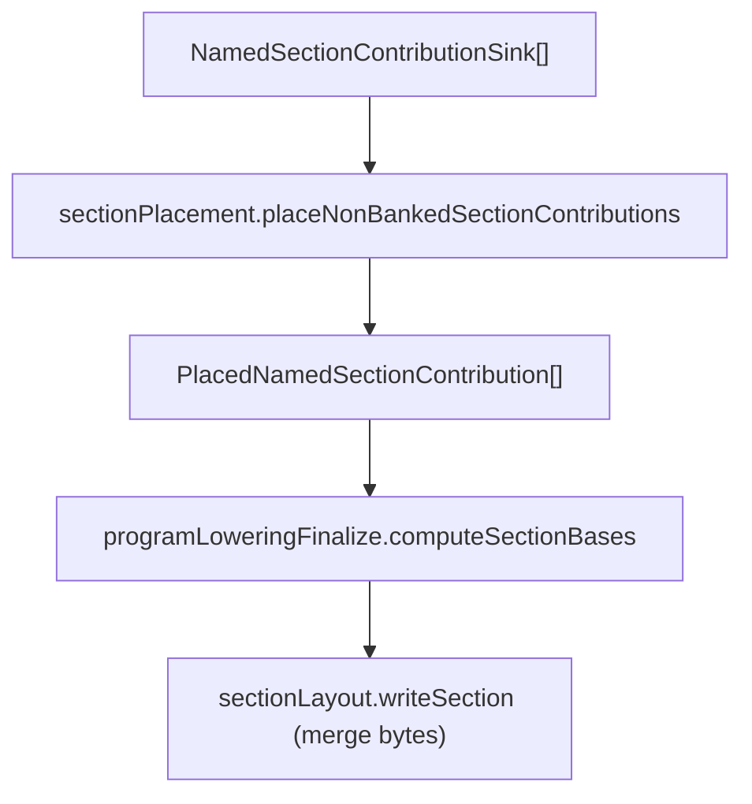

# ZAX Named Section Layout and Contributions (Retirement Reference)

This document explains the inherited ZAX named-section implementation that still
exists in the codebase while removal work is underway. It is **not** a product
reference for AZM-native source.

Native AZM uses ASM80-style `org`, labels, `.db`, `.dw`, `.ds`, textual
includes, and layout constants. It does not keep ZAX `section code/data` blocks
as a language feature. Treat the files named here as retirement/quarantine code
unless they are also used by plain ASM80 emission, fixups, or output-map
assembly.

## What this legacy flow owns

- contribution sinks that collect bytes, symbols, fixups, and startup init actions
- layout helpers for alignment, overlap checks, and written ranges
- anchor evaluation and placement for named sections
- section-base computation and routing into final address space
- startup init hooks for named data contributions

## Key data structures

### NamedSectionContributionSink

File: [`src/lowering/sectionContributions.ts`](../../src/lowering/sectionContributions.ts)

Holds the per-contribution scratch state:

- `bytes`: emitted bytes for the contribution
- `offset`: current contribution size
- `pendingSymbols`: symbols scoped to the contribution
- `fixups` / `rel8Fixups`: contribution-local fixups
- `sourceSegments`: code source mapping
- `startupInitActions`: copy/zero actions for init

### Placement products

File: [`src/lowering/sectionPlacement.ts`](../../src/lowering/sectionPlacement.ts)

- `PlacedNamedSectionContribution` — contribution plus absolute base address
- `PlacedNamedSectionRegion` — group of contributions under the same anchor key

## Ownership split (layout vs placement)

| Responsibility                                       | File                  |
| ---------------------------------------------------- | --------------------- |
| Alignment utility (`alignTo`)                        | `sectionLayout.ts`    |
| Section byte merge + overlap checks (`writeSection`) | `sectionLayout.ts`    |
| Final written range + source segment rebasing        | `sectionLayout.ts`    |
| Anchor evaluation, capacity checks                   | `sectionPlacement.ts` |
| Named section placement + overlap diagnostics        | `sectionPlacement.ts` |

## Flow overview

## Anchors and constraints

Named sections are grouped by `NonBankedSectionKeyId` and anchored once per key.
Placement rules:

- Anchor `at` expressions determine the base address.
- Optional `size` or `end` bounds limit capacity.
- Contributions are concatenated in declared order.
- Overlapping anchored regions are diagnosed.

Anchor evaluation and diagnostics live in `sectionPlacement.ts`.

## Section bases and routing

Base addresses are computed in `programLoweringFinalize.computeSectionBases` using:

- explicit `section ... at` expressions
- default `code` base (`defaultCodeBase` or 0)
- default `data` base: `alignTo(codeBase + codeOffset, 2)`
- default `var` base: `alignTo(dataBase + dataOffset, 2)`

`sectionLayout.writeSection` then merges section bytes into the final address map,
performing overlap and bounds checks.

## Startup init hooks

File: [`src/lowering/startupInit.ts`](../../src/lowering/startupInit.ts)

- Named data contributions can enqueue `startupInitActions` (copy/zero).
- `buildStartupInitRegion` aggregates these into a blob + routine.
- Finalization injects the startup block after the highest written address.

This is the only place where contribution sinks influence emitted code after
placement.

## Diagnostics and debugging map

- **Anchor evaluation failures**: `sectionPlacement.ts`
- **Capacity exceeded**: `sectionPlacement.ts`
- **Overlapping anchored regions**: `sectionPlacement.ts`
- **Byte overlap / range errors**: `sectionLayout.ts` (writeSection)
- **Startup init overflow**: `emitFinalization.ts` / `startupInit.ts`

## Read order

1. `sectionContributions.ts`
2. `sectionPlacement.ts`
3. `sectionLayout.ts`
4. `programLoweringFinalize.ts` (base computation)
5. `emitFinalization.ts` (merge + startup injection)
6. `startupInit.ts`

## Related references

- `docs/reference/LOWERING-FLOW.md`
- `docs/reference/fixup-and-section-flow.md`
