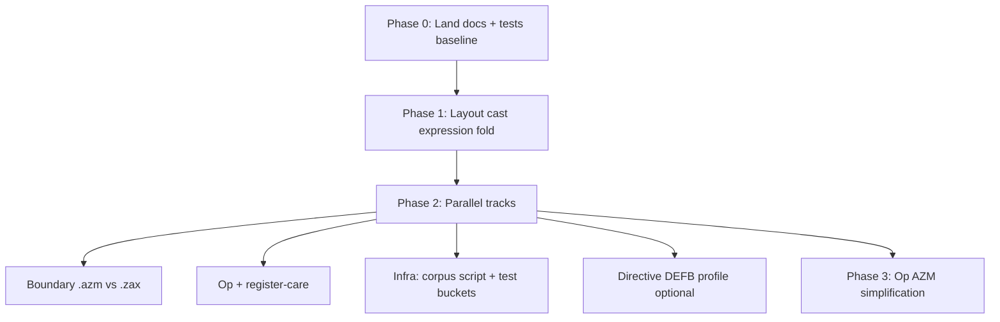

# AZM expression-first increment — implementation plan

> **For agentic workers:** Use superpowers:subagent-driven-development or
> superpowers:executing-plans. Respect file ownership; one controller integrates
> doc overlaps after parallel work.

**Goal:** Align implementation with AZM as assembler + constant expressions +
visible `op` expansion — not ZAX typed lowering.

**Read first:**

- `docs/design/azm-expression-and-visibility.md` (normative philosophy)
- `docs/design/azm-directive-aliases.md` (kept extension #1)
- `docs/design/azm-ops-subset.md` (kept extension #2)
- `docs/design/exact-size-layout-and-indexing.md`
- `docs/audits/layout-constant-api-audit.md`

**Branch:** `codex/azm-next-feature-increment` (or successor)

---

## Current state (2026-05-19)

| Area | Status |
|------|--------|
| `sizeof` / `offset` / `offset` alias | Done (`fc85509`) |
| Layout-cast tests + fold via `eaResolution` + LD hooks | **WIP uncommitted** — works but uses typed-LD paths; needs refactor |
| Philosophy + directive-alias docs | **WIP uncommitted** |
| Large parallel plan Tasks 2–6 | Mostly not started |
| `:=` strict errors breaking some ZAX fixtures | Pre-existing / boundary WIP |
| AZM `op` simplification (no ZAX type sigs) | Not started — design only |

**Corpora:** Tetro, Pacmo, MON3 — read-only validation only.

---

## Priority order (why this sequence)



1. **Expression fold** — core AZM promise; removes wrong dependency on LD lowering.
2. **`.azm` boundary`** — stops false positives and clarifies what compiles where.
3. **Op / register-care** — core kept feature; prove expanded code is visible to analysis.
4. **Infra** — guardrails and retirement map (low risk, parallel).
5. **Op simplification** — larger refactor; after subset is stable.

---

## Phase 0 — Land foundation (single agent, ~1 commit)

**No parallelism** — integrates uncommitted work.

- [ ] Commit design docs:
  - `docs/design/azm-expression-and-visibility.md`
  - `docs/design/azm-directive-aliases.md`
  - Updates to `azm-language-direction.md`, `exact-size-layout-and-indexing.md`,
    `azm-ops-subset.md`, `zax-feature-retirement-audit.md`, `azm-assembly-baseline.md`
- [ ] Commit layout-cast tests (`test/semantics/layout_cast_constants_azm.test.ts`) even if
  implementation is about to move — or commit docs only first
- [ ] Update `2026-05-19-azm-large-parallel-increment.md` header: point to this plan for
  expression-first ordering

**Verify:** `npm run test:azm:alpha`

---

## Phase 1 — Layout cast: expression fold (single agent, bottleneck)

**Owner:** Worker A only  
**Blocks:** None for docs-only workers in Phase 2  
**Conflicts:** Any other edit to `src/lowering/*Ld*`, `src/semantics/layout.ts`, `src/semantics/env.ts`

### Intent

Fold `<Type>base[i].f` in the **constant expression** layer; emit plain fixup operands.
**Delete** layout-cast special cases in `asmLoweringLd`, `ldFormSelection`,
`ldEncodingRegMemHelpers` once generic paths work.

### Tasks

1. **Extract** `foldLayoutCastEa(ea, env, evalImm) → { baseLower, addend } | undefined`
   - Prefer `src/semantics/layout.ts` or new `src/semantics/layoutCastFold.ts`
   - Reuse `offsetOfPathInTypeExpr` / `sizeOfTypeExpr` logic
   - Reject runtime indexes (registers, non-const `IndexEa`)

2. **Optional rewrite pass** before instruction lowering:
   - Constant layout-cast `Ea` → `Imm` or `EaAdd(EaName, ImmLiteral)` on operands
   - Or teach `emitAbs16Fixup` / `tryLowerLdInstruction` to call fold helper once

3. **Remove** (after tests pass):
   - `src/lowering/layoutCastEa.ts` hooks in LD encoding (keep shared `hasRuntimeIndex` if useful in semantics)
   - Special cases in `ldEncodingRegMemHelpers.emitRegFromConstantLayoutCastEa`

4. **Tests**
   - Keep `test/semantics/layout_cast_constants_azm.test.ts`
   - Add unit test on fold helper (direct, no compile) for `BASE+1` path
   - Assert equivalence: `fold(cast) === eval(offset/sizeof form))`

### Files (expected)

| Action | File |
|--------|------|
| Add/modify | `src/semantics/layoutCastFold.ts` (or `layout.ts`) |
| Modify | `src/semantics/env.ts` if imm eval integration |
| Modify | `src/lowering/eaResolution.ts` — delegate to fold or shrink |
| Revert/simplify | `src/lowering/asmLoweringLd.ts`, `ldFormSelection.ts`, `ldEncodingRegMemHelpers.ts` |
| Test | `test/semantics/layout_cast_constants_azm.test.ts`, `test/semantics/layout_cast_fold.test.ts` |

### Verify

```bash
node node_modules/vitest/vitest.mjs run test/semantics/layout_cast_constants_azm.test.ts test/semantics/layout_constants_azm.test.ts
npm run test:azm:alpha
npm test   # expect pr770/pr1334 still fail until Phase 2b
```

### Commit message

`Fold layout casts in constant expression evaluation`

---

## Phase 2 — Parallel tracks (up to 4 sub-agents)

Run **after Phase 1 merges** (or Phase 2c–2d anytime). **Do not** let two agents edit the same file.

### Track 2a — AZM-native source boundary

**Owner:** Worker B  
**Files:** `src/frontend/azmDeprecations.ts`, `test/frontend/azm_native_boundary.test.ts`,
`test/frontend/azm_source_mode_deprecations.test.ts`, `docs/audits/zax-feature-retirement-audit.md`

From large plan Task 2:

- Layout metadata (`type`, `sizeof`, `offset`, constant layout casts) → **no AZM700**
- `func`, `:=`, typed data/var/globals, structured control → **warn in `.azm`**
- **Compatibility:** `.zax` mode must not break `pr770` / `pr1334` corpora (no `:=` errors in zax mode)

**Verify:**

```bash
node node_modules/vitest/vitest.mjs run test/frontend/azm_source_mode_deprecations.test.ts test/frontend/azm_native_boundary.test.ts
```

---

### Track 2b — Op expansion + register-care

**Owner:** Worker C  
**Files:** `src/registerCare/*`, `test/registerCare/opExpansion.integration.test.ts`,
`docs/design/azm-ops-subset.md` (Verified Guardrails section)

From large plan Task 3:

- Prove register-care sees instructions after op inline expansion
- `it.skip` + TODO only if blocker is real and documented

**Verify:**

```bash
node node_modules/vitest/vitest.mjs run test/registerCare test/lowering/pr510_op_expansion_execution_helpers.test.ts
```

---

### Track 2c — Corpus guardrails + test buckets (docs/scripts)

**Owner:** Worker D  
**Files:**

- `scripts/dev/run-azm-corpus-guardrails.mjs`
- `package.json` (`test:azm:corpus`)
- `docs/reference/testing-verification-guide.md`
- `docs/audits/azm-alpha-test-buckets.md`
- Links in `zax-test-retirement-map.md`

Large plan Tasks 4 + 5. **No** parser/lowering changes.

**Verify:**

```bash
npm run build && npm run test:azm:corpus
```

---

### Track 2d — Examples + baseline doc polish

**Owner:** Worker E  
**Files:**

- `examples/azm/layout-casts.azm` (if examples tree fits)
- `docs/design/exact-size-layout-and-indexing.md` — examples using `offset` not `offset`
- `docs/spec/azm-assembly-baseline.md` — cross-links only if not done in Phase 0

Depends on **Phase 1** for compile-able layout-cast example.

Large plan Task 6.

---

### Track 2e — Optional: built-in `DEFB` aliases

**Owner:** Worker F (optional, small)  
**Files:** `src/frontend/directiveAliases.ts`, `test/frontend/directive_aliases.test.ts`

Add only if corpora need it without per-project JSON:

```ts
DEFB: '.db',
DEFW: '.dw',
DEFS: '.ds',
```

**Conflict:** Only Worker F touches `directiveAliases.ts`.  
**Decision:** Prefer project JSON for rare spellings; add built-in only after corpus audit.

---

## Phase 3 — AZM `op` simplification (single agent, later)

**Owner:** Worker G (after Phase 2)  
**Not parallel** with layout or boundary work on `parseOp.ts` / `opMatching.ts`

1. Document target AZM op declaration syntax (no ZAX type signatures; operand shapes only)
2. Narrow `src/frontend/parseOp.ts` / `src/lowering/opMatching.ts`
3. Deprecation warnings for ZAX-only op features in `.azm`
4. Tests: multiply-style op, register clobber visible in listing

See `docs/design/azm-ops-subset.md`.

---

## Parallelism matrix

| Worker | Track | Can start | Must not touch |
|--------|-------|-----------|----------------|
| A | Phase 1 layout fold | Now | — |
| B | 2a boundary | After Phase 1 (or now if only azmDeprecations) | `layout.ts`, `eaResolution` |
| C | 2b op/register-care | Now | `azmDeprecations`, layout fold files |
| D | 2c corpus + buckets | Now | `src/lowering/*` |
| E | 2d examples | After Phase 1 | `src/lowering/*` |
| F | 2e DEFB aliases | Anytime | Same file as other alias edits |

**Max safe parallelism:** 3 (e.g. A finished → B + C + D; E waits on A).

---

## Integration checklist (controller)

After parallel merges:

```bash
git log --oneline -15
git status --short
node node_modules/vitest/vitest.mjs run \
  test/semantics/layout_cast_constants_azm.test.ts \
  test/semantics/layout_constants_azm.test.ts \
  test/frontend/azm_native_boundary.test.ts \
  test/registerCare/opExpansion.integration.test.ts
npm run test:azm:alpha
npm run test:azm:corpus   # if Track 2c landed
npm test                  # full suite
```

Resolve doc wording overlaps once (expression vs ops vs aliases).

---

## Superseded / archived plan notes

- `2026-05-19-azm-large-parallel-increment.md` Task 1 **implementation approach**
  (wire via `eaResolution` + LD) is superseded by Phase 1 here — keep tests, change architecture.
- ZAX lowering flow docs (`docs/reference/ld-lowering-flow.md`) are historical; do not
  use as AZM implementation guide.

---

## Success criteria for this increment

1. Layout casts fold in semantics; `ld` uses generic fixups only.
2. `.azm` warns on ZAX high-level features; `.zax` compatibility tests pass.
3. Register-care documents (or tests) op expansion visibility.
4. Directive aliases and ops documented as distinct kept mechanisms.
5. Optional local corpus command; test bucket doc exists.
