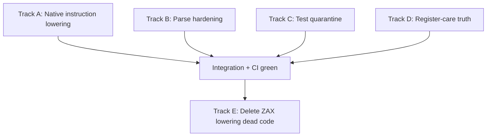

# AZM native lowering increment — implementation plan

> **Status:** active (post-merge of PR #7)  
> **Date:** 2026-05-20  
> **Supersedes:** remaining work in `2026-05-19-azm-expression-first-increment.md` Phases 2–3

**Goal:** One assembler path for native `.azm` — flat labels, classic data directives,
visible `op` bytes, layout constants in operands — with ZAX compatibility isolated to
`.zax` / `.asm` / `.z80` until deletion.

**Read first:**

- `docs/audits/azm-removal-inventory.md` (keep vs remove)
- `docs/design/azm-expression-and-visibility.md`
- `docs/audits/azm-alpha-test-buckets.md`

**Branch:** `codex/azm-native-lowering-increment` (suggested)

---

## Landed (PR #7, merged to `main`)

| Deliverable | Notes |
|-------------|--------|
| Layout-cast constant fold | `src/semantics/layoutCastFold.ts` + `eaResolution` |
| Flat `.azm` parse | `parseAzmAsmStream.ts`; `func` / `section` → errors |
| AZM700 boundaries | Layout metadata OK; `:=` / structured control warn |
| Alpha guardrails | `test:azm:alpha`, corpus script, test buckets, op/regcare tests |
| Docs | Expression model, removal inventory, directive aliases, ops subset |

**Still shimmed on `.zax`:** layout-cast compile tests, op bin expansion test, anything needing full `ld`/op lowering inside legacy wrappers.

---

## North star (native `.azm` module)

```asm
type Sprite
    x: byte
    flags: byte
end

const FLAGS_OFF .equ offset(Sprite, flags)

op clear_a()
    xor a
end

    org $2000
SPRITES:  ds sizeof(Sprite[16])

    org $0100
main:
    clear_a
    ld a,(<Sprite>SPRITES[0].flags)
    call work
    ret

work:
    ld hl, SPRITES + FLAGS_OFF
    ret
```

No `func`, no `section`, no `:=`, no structured `if`/`select` as language features.

---

## Priority order



| Track | Why first |
|-------|-----------|
| **A — Native lowering** | Without it, flat `.azm` is parse-only theater; ops and layout-cast `ld` fail at encode |
| **B — Parse hardening** | Deprecated syntax should be **errors** in `.azm`, not warn-and-miscompile |
| **C — Test quarantine** | Shrink CI to ASM80 + regcare + layout + ops; move `.zax` matrix to optional lane |
| **D — Register-care** | Analyze expanded instructions, not `clear_a` heads |
| **E — Deletion** | Only after A–D and `test:azm:alpha` + corpus stay green |

---

## Track A — Unified native instruction lowering (bottleneck)

**Owner:** one agent; conflicts with any other `src/lowering/*` work.

### Problem

`programLoweringTraversal` sends module-scope `AsmInstruction` through
`lowerClassicInstruction`, which does not run `op` expansion or full `ld`/assignment
pipelines. Function bodies use `functionCallLowering` + `lowerAsmInstructionDispatcher`.

### Tasks

1. **`lowerNativeAsmInstruction(ctx, item, sink?)`**
   - Extract minimal path from `functionCallLowering` / `prepareFunctionBodyLoweringPhase`:
     - `tryHandleOpExpansion` → `lowerAsmInstructionDispatcher` → fallback classic encode
   - No frame setup, no locals, no typed calls
   - Works for module-scope items in `.azm` (and optionally flat classic modules)

2. **Wire in `programLoweringTraversal`**
   - When `sourceMode === 'azm'` (or item from flat asm stream): call native path
   - Keep `.zax` / `FuncDecl` on existing function lowering until Track E

3. **Module-scope data**
   - Allow `.db` / `.dw` / `.ds` / `.org` at module scope in `.azm` (classic items or
     extend `parseAzmAsmStream` delegation to classic line parser)
   - Reject typed `data` blocks in `.azm` (parse error, not AZM700 only)

4. **Rewrite tests to flat `.azm`**
   - `layout_cast_constants_azm.test.ts` — no `export func` / `section`
   - `opExpansion.integration.test.ts` — bin test on `.azm`, not `.zax` shim

### Verify

```sh
npm run test:azm:alpha
npm test -- --run test/semantics/layout_cast_constants_azm.test.ts
npm test -- --run test/registerCare/opExpansion.integration.test.ts
```

### Files (expected touch)

| Area | Files |
|------|--------|
| Lowering | `programLoweringTraversal.ts`, new `nativeAsmLowering.ts` (thin) |
| Reuse | `functionCallLowering.ts`, `opExpansionOrchestration.ts`, `asmInstructionLowering.ts` |
| Parse | `parseModuleItemDispatch.ts`, `parseClassicModule.ts` or `classicLine.ts` |
| Tests | `test/semantics/layout_cast_*.test.ts`, `test/registerCare/opExpansion.*` |

---

## Track B — Parse hardening (parallel, low conflict)

**Owner:** frontend agent; avoid `src/lowering/*`.

### Tasks

1. **Errors instead of warnings** in `.azm` for:
   - `:=`, structured control tokens, typed `data`/`var`/`globals`, `extern func`
   - (Keep AZM700 only for things that still parse but should not — or eliminate AZM700 for these)

2. **Reject `Unimplemented` silently** — `parseAzmAsmStream.ts` should surface diagnostics

3. **Control-stack tests**
   - Multi-line `if z` / `repeat` at module scope: parse succeeds only for negative tests;
     positive compile tests only after Track A or expect parse error

4. **Entry labels** — document `@main` / asm80 `@` entry convention for register-care export

### Verify

```sh
npm test -- --run test/frontend/azm_flat_module_asm.test.ts
npm test -- --run test/frontend/azm_native_boundary.test.ts
npm test -- --run test/diagnostics_reachability.test.ts
```

---

## Track C — Test quarantine (parallel, docs + CI)

**Owner:** infra agent.

### Tasks

1. **CI split**
   - Default PR CI: `test:azm:alpha` + typecheck + lint (already lean)
   - Nightly / label `zax-compat`: full `npm test` or filtered `zax-test-retirement-map` compatibility bucket

2. **First deletion batch** (only files with zero `.azm` path and duplicate coverage)
   - Review `docs/audits/zax-test-retirement-map.md` “retirement candidate” rows
   - Delete or move to `test/zax_compat/` with `describe.skip` in default run

3. **Corpus**
   - Document `npm run test:azm:corpus` in PR checklist
   - Optional: wire one corpus job on `workflow_dispatch`

### Verify

Guardrail count stable; no ASM80/regcare/layout regressions.

---

## Track D — Register-care on expanded code (parallel after A starts)

**Owner:** register-care agent.

### Tasks

1. **Post-expansion model** (preferred)
   - Either lower to a temporary instruction list for analysis, or walk lowered asm stream
   - `clear_a` → `xor a` visible to `inferRoutineSummary`

2. **Update** `docs/design/azm-ops-subset.md` Verified Guardrails table

3. **Tests**
   - `opExpansion.integration.test.ts`: `mayWrite` includes `A` after expansion
   - Routine discovery for flat `.azm` `main:` (already partially done)

### Depends on

Track A at least for op expansion in native compile path.

---

## Track E — Deletion increment (later, single agent)

**Do not start until Tracks A–D are green on `main`.**

| Subsystem | Remove when |
|-----------|-------------|
| Function frame lowering | No `.azm` / test relies on generated frames |
| Named section placement | `.azm` rejects `section`; corpora use org/labels |
| Typed assignment lowering | `.azm` parse error; ZAX lane quarantined |
| Structured control lowering | Same |
| `layoutCastEa` LD special cases | Already folded — delete dead LD hooks |
| AZM700 for constructs that no longer parse | After Track B |

Estimate: multi-week; one subsystem per PR.

---

## Suggested PR sequence (next big increment)

| PR | Scope | ~size |
|----|--------|-------|
| **PR 1** | Track A core — `lowerNativeAsmInstruction` + wire module-scope `.azm` | Large |
| **PR 2** | Track A data — module `.org`/`.db`/`.dw`/`.ds` in `.azm` | Medium |
| **PR 3** | Track B — parse errors + tests | Medium |
| **PR 4** | Track C — CI quarantine + first test deletes | Medium |
| **PR 5** | Track D — register-care post-expansion | Medium |
| **PR 6+** | Track E — deletion slices | Ongoing |

PRs 3–4 can run parallel to PR 1 if file ownership is respected.

---

## Success criteria (increment complete)

- [ ] Flat `.azm` compiles `op` calls to real opcodes without `.zax` shim
- [ ] Layout-cast `ld` / `ld (expr)` works at module scope in `.azm`
- [ ] Module-scope `org` + `.db`/`.dw`/`.ds` work in `.azm`
- [ ] Deprecated ZAX syntax is **parse error** in `.azm` (not warn-only miscompile)
- [ ] `npm run test:azm:alpha` green; optional corpus documented
- [ ] Register-care sees expanded op effects (or documented interim with explicit skip removed)
- [ ] Compatibility bucket defined in CI; first retirement-candidate tests removed or quarantined
- [ ] `azm-removal-inventory.md` phase 2–3 marked done

---

## Explicit non-goals (this increment)

- Package rename (`zax` → `azm` CLI) — release planning
- Full `enum` decision — defer
- Text macros — out of scope
- MON3/Tetro/Pacmo source edits — read-only corpora
- Op declaration syntax simplification (drop ZAX type sigs) — following increment

---

## Agent notes

- **File ownership:** one writer on `src/lowering/*` at a time (Track A).
- **Philosophy check:** new code must not synthesize instructions the programmer did not write (except visible `op` bodies).
- **Corpora:** validate only; never commit upstream repo changes.
